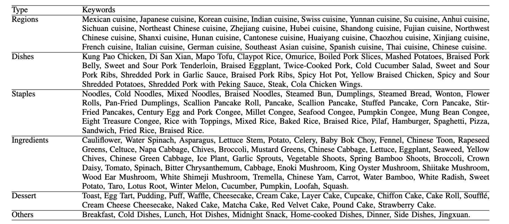
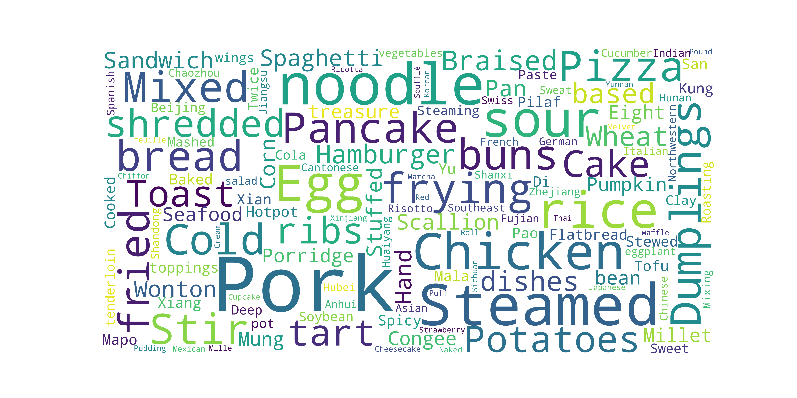

# RecipeGen
A Real-World Goal-Step-Image Recipe Dataset. <br>
Data can be [download](https://1drv.ms/u/c/3de24ecbad483902/EUx9G_7wy45Mprq0CEqopcwBwOJsT4mCfy981LkUgPwNYQ?e=2ydzOo).

**RecipeGen: A Benchmark for Real-World Recipe Image Generation** [[Paper](https://arxiv.org/abs/2503.05228)] <br>

## 📚 Introduction
We propose RecipeGen Benchmark (RGB), a goal-instruction image dataset designed to evaluate text-to-image models (T2Is) in understanding cooking instructions. RGB includes 21,944 recipes with 139,872 images and steps, encompassing diverse regional dishes and cooking styles. Collected from a large set of user-uploaded, real-world recipes.
Every recipe contains goal, steps and images.
There are some examples.


## 🧪 Keywords
We have 158 keywords totally.





## 📧 Contact
If you have any questions or suggestions, feel free to reach out:

- Email: zhangrx22@mails.jlu.edu.cn
### 📝 Citing

If you found this benchmark useful, please consider citing:

```bibtex
@article{zhang2025recipegen,
  title={RecipeGen: A Benchmark for Real-World Recipe Image Generation},
  author={Zhang, Ruoxuan and Xie, Hongxia and Yao, Yi and Jiang-Lin, Jian-Yu and Wen, Bin and Lo, Ling and Shuai, Hong-Han and Li, Yung-Hui and Cheng, Wen-Huang},
  journal={arXiv preprint arXiv:2503.05228},
  year={2025}
}
```
